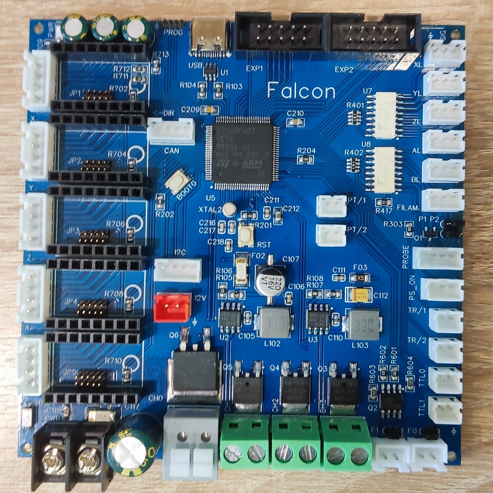
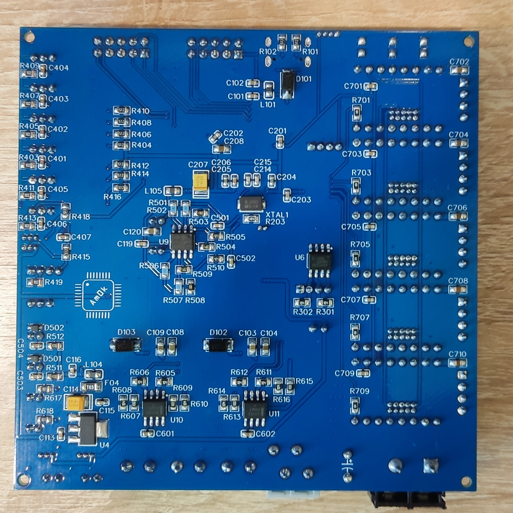
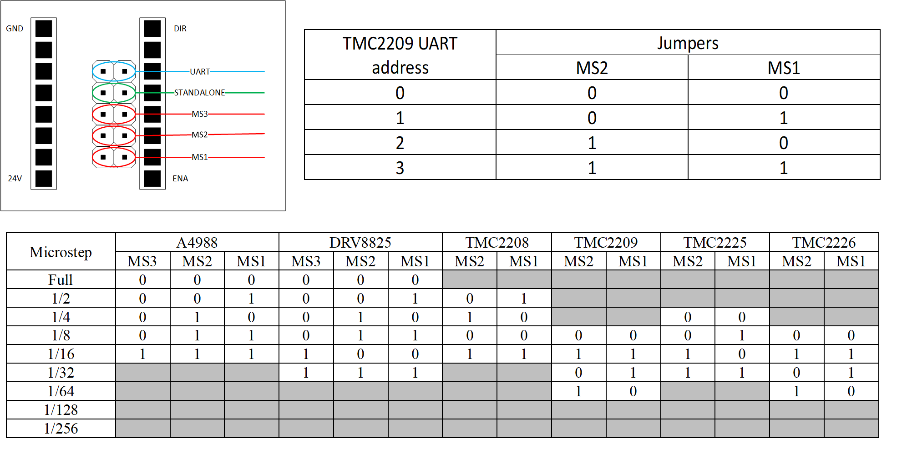

  
  
  
  

<h1 align="center">Falcon CNC board</h1>

Проект открытой управляющей платы ЧПУ на основе МК STM32F407VET6. Разработана для работы под управлением прошивки Marlin.

## Marlin 2.1.2.5

Плата поддерживает и протестированна с прошивкой на базе Marlin 2.1.2.5. 
В репозитории вы можете найти пример исходников модифицированной прошивки с уже добавленной поддержкой платы, 
а так же [инструкцию](/Software/Readme.md) по модицикации оригинальных исходников <a href="https://github.com/MarlinFirmware/Marlin">Marlin</a>. 
Для компиляции использовался <a href="https://code.visualstudio.com">Visual Studio Code</a> с 
установленным <a href="https://platformio.org/">PlatformIO</a>, перед сборкой выбираем окружение `env:Falcon_v1_dfu` 
для прошивки по DFU, `env:Falcon_v1_stlink` для прошивки с помощью ST-LINK.

## Дополнительное ПО.

Так же вам могут быть полезны следующие программы для заливки прошивки по DFU:
 * <a href="https://www.st.com/en/development-tools/stsw-stm32080.html">DfuSe USB device firmware upgrade</a>
 * <a href="https://www.st.com/en/development-tools/stm32cubeprog.html">STM32 Cube Programmer</a>

## Внешний вид.

  
  

## Особенности.
Плата построена на базе современного 32-битного МК STM32F407VET6.

- Питание платы осуществляется от блока питания 24 В, никаких дополнительных линий питания не требуется.

- Возможность подключения до 5 независимых осей. Реализовано управление драйверами ШД через UART. Для конфигурирования 
работы драйверов в режиме Standalone или UART, а так же настройки микрошага, установите соответствующие перемычки.

	

- Питание нагревателя экструдера и шаговых двигателей осуществляется напряжением первичного питания (24 В).

- 4 силовых управляемых выходов для подключения нагревателей стола, экструдера, дополнительных устройств от 24 В.

- 2 управляемых TTL выхода для подключения внешних SSR реле.

- 2 управляемых вентилятора с возможностью выбора напряжения питания для каждого из них.

- 5 независимых концевых выключателей, имеющих опторазвязку. Напряжение питание концевых выключателей может быть выбрано.
К использованию рекомендуются концевые выключатели, в которых общий (COM) сигнальный контакт нормально-замкнут на землю и при срабатывании 
коммутируется с напряжением питания. При таком способе подключения выключатель "срабатывает" так же в случае его обрыва или отсоединения от платы. 
Также может быть использован индуктивный выключатель NPN с нормально замкнутым контактом (LJ12A3-4-ZAX или аналогичные).

- Разъем `PROBE` для подключения датчиков BL-touch или аналогичных.

- Разъем `FILAMENT` для подключения датчика филамента (с опторазвязкой).

- Возможность реализовать автоотключение внешним реле через сигнал `PS_ON`.

- 2 аналоговых входа для подключения стандартных NTC термисторов.

- 2 аналоговых входа на базе ОУ MCP6022 для подключения датчиков температуры PT1000.

- На дополнительные разъемы EXP1 и EXP2 выведены интерфейсы SPI, UART для подключения внешних устройств. Плата
протестированна с модулями дисплеев RepRap Discount Smart Controller и MKS MINI12864 V3.

- Отдельный разъем для подключения I2C устройств.

- Отдельный разъем для подключения CAN BUS (требуется отдельный внешний трансивер).

- Настройки хранятся в EEPROM AT24C32.

- USB интерфейс защищен от электростатических разрядов. 

- Возможность прошивки платы через ST-LINK, либо по DFU протоколу через USB, переведя плату в режим DFU (для этого необходимо
перезагрузить плату с нажатой кнопкой BOOT0).

Подробнее о подключении периферии к плате вы можете посмотреть на этом [PREVIEW](/Hardware/BOARD_PREVIEW.pdf).

## BOM и производство.

Оригинальные печатные платы были произведены JLCPCB. Для самостоятельного изготовления или заказа вы можете воспользоваться
GERBER-файлами и BOM-листом, приложенными в репозитории.

## Обратная связь.

Буду рад любой обратной связи относительно этого проекта, а так же отвечу на вопросы.
Почтовый адрес `b1gb0ss@mail.ru`.
Так же буду крайне благодарен в случае помощи с качественным переводом информации, размещенной в данном репозитории.

## Лицензия.

Принципиальная схема, BOM-лист, аннотации к нему и файлы для производства находятся под действием 
[CERN Open Hardware Licence Version 2 - Strongly Reciprocal](/LICENSE.txt). Исходный код примеров прошивок публикуется 
под лицензиями, которым подчиняется оригинальный исходный код. Ответственность за использование любых материалов этого 
репозитория целиком и полностью лежит на вас. Я верю в открытую разработку силами энтузиастов, и прошу вас так же 
делиться своими наработками. Если же вы собираетесь использовать эти наработки в закрытом виде или защищенном патентом виде, 
прошу вас выбрать другие источники.